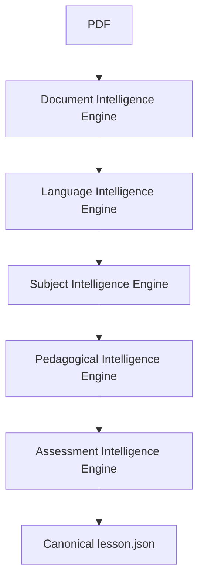

# STEM Lesson AI Generator

An enterprise-grade, multi-stage intelligence pipeline designed to autonomously convert raw STEM documents (PDFs) into fully structured, pedagogically sound lesson plans and presentations.

## Vision

To revolutionize STEM education by providing educators with a robust, transparent, and highly structured AI platform that deterministically parses complex educational materials—including equations, tables, figures, and textual semantics—into interactive, structured lesson modules.

## Features

- **Deterministic Processing First**: Avoids AI hallucinations by relying on robust deterministic parsing for document structure, layout, and language identification.
- **Fail-Safe Semantic Extraction**: AI processing is pluggable and degrades gracefully to deterministic outputs if providers fail, ensuring a continuous pipeline.
- **Multi-Stage Intelligence Pipeline**: A specialized sequence of intelligence engines processes documents step-by-step.
- **Single Source of Truth**: Data flows continuously through `lesson.json` representations, maintaining perfect traceability from raw PDF to the final generated lesson.

## Overall Architecture

The system utilizes a 10-phase frozen architecture ensuring strict separation of concerns. The platform separates file ingestion, structural parsing, linguistic enhancement, and pedagogical mapping into distinct, highly testable engines.

## Processing Pipeline



## Current Development Status

- ✅ **Phase 1**: Project Foundation
- ✅ **Phase 2**: Dashboard Foundation
- ✅ **Phase 3**: Document Intelligence Engine (DIE)
- ✅ **Phase 4**: Language Intelligence Engine (LIE)
- **Phase 5**: Subject Intelligence Engine (SIE)
- **Phase 6**: Lesson Planning Engine (LPE)
- **Phase 7**: Rendering Engine (RE)
- **Phase 8**: Presentation Engine (PE)
- **Phase 9**: History, Templates and Settings
- **Phase 10**: Optimization, Performance and Testing

## Technology Stack

- **Frontend**: React, TypeScript, Vite, Tailwind CSS
- **Backend**: Python 3.11, FastAPI, Uvicorn
- **Database**: PostgreSQL with Prisma ORM
- **AI**: Google Generative AI (Gemini), Pluggable Architecture for OpenAI/Claude
- **OCR & Parsing**: PyMuPDF, PyTesseract, OpenCV
- **Testing**: Python `unittest`, strict Pydantic schemas

## Folder Structure

```text
STEM-Lesson-AI-Generator/
├── backend/
│   ├── core/                  # Core configurations, central logging, and system settings
│   ├── services/              # Isolated Intelligence Engines (DIE, LIE, etc.)
│   │   ├── document_intelligence/
│   │   └── language_intelligence/
│   ├── workers/               # Asynchronous task orchestrators (e.g., pdf_worker.py)
│   └── tests/                 # Comprehensive unit and integration test suites
├── frontend/                  # React dashboard and user interface
│   ├── src/
│   │   ├── components/        # Reusable UI components
│   │   └── pages/             # Application views
│   └── ...
├── database/                  # PostgreSQL schemas and Prisma models
└── uploads/                   # Local file staging and job workspace directories
```

## Installation

1. **Clone the repository:**
   ```bash
   git clone https://github.com/your-org/STEM-Lesson-AI-Generator.git
   cd STEM-Lesson-AI-Generator
   ```

2. **Backend Setup:**
   ```bash
   cd backend
   python -m venv venv
   source venv/bin/activate  # On Windows use: venv\Scripts\activate
   pip install -r requirements.txt
   ```

3. **Environment Configuration:**
   Copy `.env.example` to `.env` and fill in your API keys (e.g., `GEMINI_API_KEY`).

4. **Run the Backend:**
   ```bash
   uvicorn main:app --reload
   ```

5. **Frontend Setup:**
   ```bash
   cd frontend
   npm install
   npm run dev
   ```

## Development Roadmap

The platform is strictly adhering to the 10-phase frozen architecture. Phase 5 (Subject Intelligence Engine) will introduce domain-specific intelligence (e.g., mathematical proof verification, chemical formula balancing). Future phases will integrate rendering to physical formats (HTML, PDF, PPTX).

## Contributing

As this is an enterprise-grade project with a frozen architecture, all contributions must strictly adhere to the established engine sequences and Pydantic schema boundaries. Pull requests must pass the `unittest` suite without degrading performance or introducing non-deterministic hallucinations into the base pipeline.

## License

This project is licensed under the MIT License - see the LICENSE file for details.

## Acknowledgements

- Built with [FastAPI](https://fastapi.tiangolo.com/)
- Document intelligence powered by [PyMuPDF](https://pymupdf.readthedocs.io/) and [Tesseract OCR](https://github.com/tesseract-ocr/tesseract)
- AI integration facilitated by [Google Generative AI](https://ai.google.dev/)
